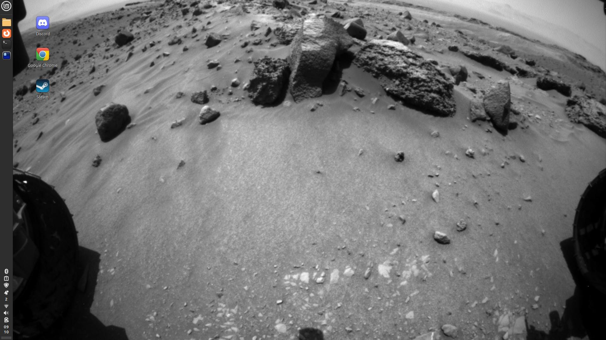

# nasa_desktop_images
A script to pull NASA images from the NASA API and set them as your desktop background. Now you can have the coolest images this side of the Asteroid Belt as your desktop wallpaper.



## Setup 
Run the `setup.sh` script. This will pull in needed pythons dependencies from the `requirements.txt` file.
This will also create the necessary directory structure that the python needs to be able to download the images.

~~Eventually this script will also set up a cron to run the python at a set interval.~~

So the cron was a bit more of hassle than it was worth. After spending more than a few hours trying to get the cron to behave, I pretty much decided that it would be easier to do *something else*. That something else is just a while loop that runs the `main()` function.

### Usage
Running the script is now a little bit less clean than I originally envisioned. To run, type `python main.py <num_minutes>` to get things up and running. `num_minutes` will be used to configure how long the script will wait before requesting a new wallpaper. If you dont want to have a terminal dedicated to this script try `python main.py <num_minutes> &` to run in the background. Just make sure you take note of the PID so you can kill it later. 

## API Key
The use of this script does require the use of an API Key from NASA. Thankfully, it is fairly painless to obtain one of these. To get your own key, navigate to https://api.nasa.gov/ and fill out the form. A key will be sent to the email you provided in the form. Keep this key somewhere you feel is safe. For the purposes of using the scripts in this repo, storing it in an ENV variable called `NASA_API_KEY` is recommended.

If you are just curious about using this scrip and dont want to bother with your own key yet, you may be able to use the NASA `DEMO_KEY` key. Heads up though, this demo key is very limited with only 30 requests per IP per hour.

## Logging
Logging is set up to log to the `logs.log` file using pythons built in logging package.

An example log segment looks like this:
```
2025-06-27 10:09:56.000: INFO | Archving any existing files into /home/brendan/Pictures/Wallpapers/NASA/Archived
2025-06-27 10:09:56.001: INFO | File epic_1b_20250626000830.png successfully archived.
2025-06-27 10:09:56.001: INFO | Making request out to api.nasa.gov for image information
2025-06-27 10:09:56.923: INFO | Making request to api.nasa.gov for image epic_1b_20250626000830 from date 2025/06/26
2025-06-27 10:09:57.533: INFO | Writing to file /home/brendan/Pictures/Wallpapers/NASA/epic_1b_20250626000830.png
2025-06-27 10:10:45.679: INFO | File write was successful.
2025-06-27 10:10:45.679: INFO | Attempting to set wallpaper to epic_1b_20250626000830.png
2025-06-27 10:10:45.679: INFO | Running command gsettings set org.cinnamon.desktop.background picture-url file:///home/brendan/Pictures/Wallpapers/NASA/epic_1b_20250626000830.png.
2025-06-27 10:13:18.222: INFO | Archving any existing files into /home/brendan/Pictures/Wallpapers/NASA/Archived
2025-06-27 10:13:18.223: INFO | File epic_1b_20250626000830.png successfully archived.
2025-06-27 10:13:18.223: INFO | Making request out to api.nasa.gov for image information
2025-06-27 10:13:19.154: INFO | Making request to api.nasa.gov for image epic_1b_20250626000830 from date 2025/06/26
2025-06-27 10:13:19.730: INFO | Writing to file /home/brendan/Pictures/Wallpapers/NASA/epic_1b_20250626000830.png
2025-06-27 10:14:08.605: INFO | File write was successful.
2025-06-27 10:14:08.605: INFO | Attempting to set wallpaper to epic_1b_20250626000830.png
2025-06-27 10:14:08.605: INFO | Running command gsettings set org.cinnamon.desktop.background picture-uri file:///home/brendan/Pictures/Wallpapers/NASA/epic_1b_20250626000830.png.
2025-06-27 10:14:08.605: ERROR | [Errno 2] No such file or directory: 'gsettings set org.cinnamon.desktop.background picture-uri file:///home/brendan/Pictures/Wallpapers/NASA/epic_1b_20250626000830.png'

```
You can monitor the log file as it updates in the file itself or with `tail -f path/to/logs` to follow the logs in the terminal.

## Archiving
At the start of each script run all the existing files (except the current active one) in the wallpaper directory will be moved to the `Archived/` directory. 